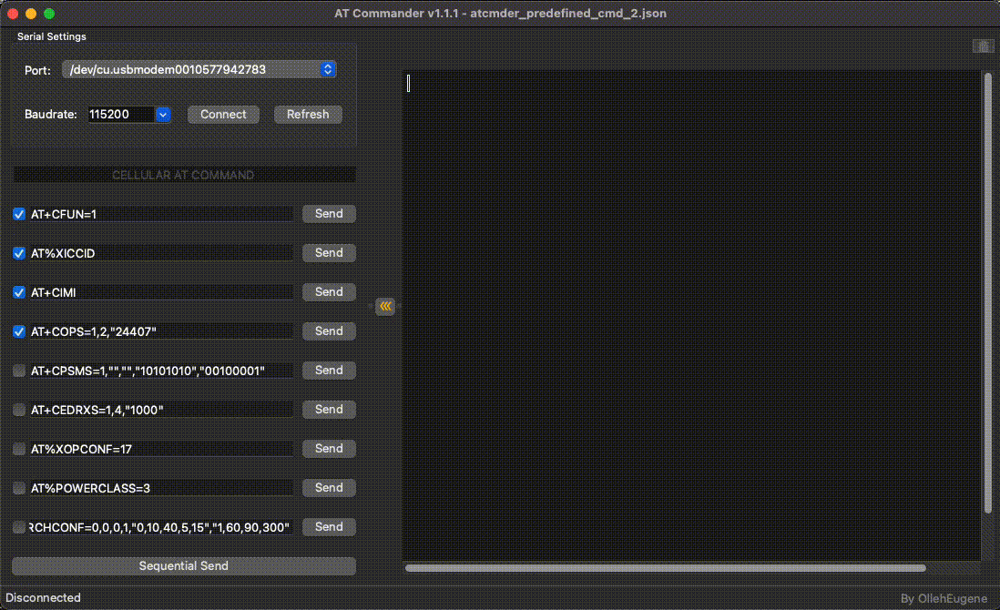

# atcmder

This program is designed to make it easier to control devices via serial communication by allowing users to send predefined commands with a single click. While it also supports the traditional method of entering commands manually through a terminal window, it provides additional functionality such as sending individual preset commands using dedicated send buttons, or executing multiple commands at once based on a scheduled time.

For more detailed information about the supported features, please refer to the description below.

**Support Features**

1. ANSI color scheme for enhanced terminal readability
2. Input history (up to 50 entries)
3. Load and manage predefined AT command sets
4. Automatic reconnection to the last 5 connected devices
5. Sequential sending of AT commands
6. Expandable/collapsible terminal window
7. Shortcut keys for adjusting font size 
   * CMD+'+' : Increase font size
   * CMD+'-' : Decrease font size
   * CMD+'0' : Reset font size
8. Support for user-defined baud rates
9. Support multiple OSes

 
> Note: When using it on macOS, you need to allow it in the Security & Privacy settings in order to use it

